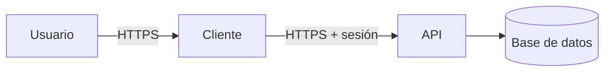

# Threat model

| Campo | Valor |
|-------|--------|
| Sistema | {nombre} |
| Modo | inception \| delta \| review |
| Metodología | STRIDE {+ LINDDUN} |
| Fecha | {YYYY-MM-DD} |
| Alcance | {qué entra / qué queda fuera} |
| Datos personales | sí \| no |

## 1. Contexto

{Para qué es el sistema, actores de negocio, exposición (público / interno).}

## 2. Diagrama de flujos (DFD)

## 3. Límites de confianza

| Límite | De | A | Qué cruza |
|--------|----|---|-----------|
| | | | |

## 4. Activos

| Activo | Sensibilidad | Dónde vive |
|--------|--------------|------------|
| | pública / interna / PII / secreto | |

## 5. Supuestos

- {ej. TLS termina en el reverse proxy}
- {ej. el IdP es de confianza}

## 6. Amenazas

| ID | STRIDE | Elemento | Amenaza | Severidad | Estado | Mitigación |
|----|--------|----------|---------|-----------|--------|------------|
| T-01 | S | | | High | Open | |

Estados: `Open` | `Mitigated` | `Accepted` | `Transferred`.

Severidad (bug bar):

- **Critical** — bypass de auth, compromiso masivo de PII/secretos, RCE de diseño
- **High** — escalada, tampering de datos sensibles, IDOR amplio
- **Medium** — DoS acotado, fuga no-PII, repudiación sin impacto legal
- **Low** — requiere insider ya privilegiado o impacto teórico

## 7. Privacidad (LINDDUN)

_Omitir la sección si no hay PII._

| ID | Categoría | Elemento | Amenaza | Severidad | Estado | Mitigación |
|----|-----------|----------|---------|-----------|--------|------------|
| P-01 | | | | | | |

## 8. Riesgo residual

| ID | Por qué se acepta | Quién | Fecha |
|----|-------------------|-------|-------|
| | | | |

## 9. Tests de abuso

Casos derivados del modelo (no happy path):

- {ej. acceso a recurso de otro usuario → 403}

## 10. Changelog

| Fecha | Modo | Qué cambió |
|-------|------|------------|
| | inception | Modelo inicial |
